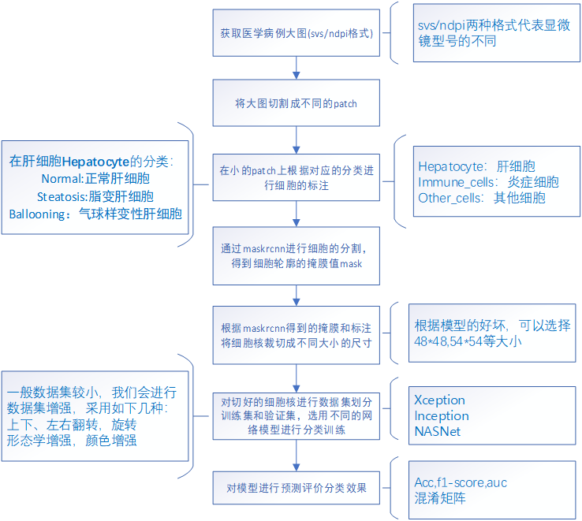

# 非酒精性脂肪肝细胞的分类
# 项目背景介绍
## 1.项目研究意义
   肝脏是动物最大、功能最广泛的器官之一。它将食物中的糖、蛋白和脂肪转化为对身体有用的物质，并将它们释放到细胞中。肝脏除了在新陈代谢中发挥作用外，还是一种免疫器官，对血液的排毒是必不可少的。肝脏对健康具有极大的重要性，所以对于肝脏细胞病变的预防以及研究具有很大的意义。基于相应的基础研究，人们对于病毒性肝炎及病毒如何入侵并危害肝脏已经有了相对成熟、系统的认知和应对策略。然而，人们往往会视外侵者为“眼中钉”，反而对过量脂质等潜入者的危害视而不见，对非酒精性脂肪肝炎的新近病理生理研究显示，有“潜入者”的肝脏细胞，也能启动免疫体系，如果程度严重甚至启动“毁灭”程序。
当非酒精性脂肪肝病发展到严重的炎症阶段，肝脏内巨噬细胞就会异常活跃起来，它们会从血液中募集更多兄弟炎症细胞，例如白细胞就会进到肝脏里面，出现炎症细胞浸润。“这个时候如果做病理分析，就会看到肝脏里面有很多炎症细胞，围着变大的肝脏细胞。，这就说明肝脏细胞里边“出事儿”了，不要以为炎症细胞是去解救肝脏细胞的，很可能炎症细胞已经认为它是不正常细胞，想把它干掉。而这个机制与肝炎病毒入侵后，免疫系统对带毒肝脏细胞的“绞杀”很相似。
 
        hepatocyte                 immune_cells                   other_cells

<figure class="third">
    
    
    
</figure>
### 分出hepatocyte之后，再从中分三类
 
        ballooning                    normal                      steatosis

<figure class="third">
    
    
    
</figure>

### 注意：第一个三分类模型输入是72*72，裁切图片的时候patch为54*54，第二个模型输入是96*96，裁切图片的时候patch为96*96
## 2.项目具体流程

# 运行环境要求
```python
pip install keras==2.2.0
pip install tensorflow-gpu==1.7.0
pip install numpy==1.14.5
pip install opencv-python==3.4.4.19
# 代码需要spams库的支持，126已安装
# 若提示缺少spams，请按照以下步骤安装
#具体步骤：
#1.先在用户主目录下创建src目录，然后切换到src目录下操作
mkdir ~/src
cd ~/src
#2.安装blas
wget http://www.netlib.org/blas/blas.tgz
tar zxf blas.tgz
#具体版本号以下载的最新版本为主
cd BLAS-3.5.0/
#3、编译
#如果是32位系统，使用GNU的g77或gfortran编译器来编译：
g77 -O2 -fno-second-underscore -c *.f
gfortran -O2 -std=legacy -fno-second-underscore -c *.f
#如果是64位系统，使用GNU的g77或gfortran编译器来编译：
g77 -O3 -m64 -fno-second-underscore -fPIC -c *.f
gfortran -O3 -std=legacy -m64 -fno-second-underscore -fPIC -c *.f
#如果使用的是Intel的Fortran编译器，则：
ifort -FI -w90 -w95 -cm -O3 -unroll -c *.f
#注意：
#请根据情况选择上述5个命令中的一个执行
#在编译BLAS、LAPACK、NumPy和SciPy的时候，所选择的Fortran编译器必须要保持一致
#在下述LAPACK的编译安装中，需要使用Fortran 90编译器，因此不应该使用g77来编译BLAS
#4.安装LAPACK
wget http://www.netlib.org/lapack/lapack.tgz
tar zxf lapack.tgz
#具体版本号以下载的最新版本为主
cd lapack-3.6.0/
#5.注意：在执行make lapacklib之前，编辑make.inc文件，给OPTS和NOOPT这两个设置都加上-fPIC选项。如果是64位系统，还需要加上-m64选项。修改后
FORTRAN  = gfortran 
OPTS     = -O2 -frecursive -fPIC -m64
DRVOPTS  = $(OPTS)
NOOPT    = -O0 -frecursive -fPIC -m64
LOADER   = gfortran
#6.编译
cp INSTALL/make.inc.gfortran make.inc   # On Linux with lapack-3.2.1 or newer
make lapacklib
#7.后续工作
make clean      # 清理文件
export LAPACK=~/src/lapack-3.6.0/   # 导出LAPACK环境变量
```
# 代码整理封装
## maskrcnn
该文件夹里面保存的是用于进行细胞核分割的代码,先是进行utils中的openslide_img.py进行在0级大图下进行裁切图片，
得到图片以后修改main.py中的patchsize大小，以及需要进行maskrcnn分割的图片路径，然后在终端运行python main.py，即可得到细胞的轮廓mask
## etl
该文件夹存放的是数据处理的代码，通过maskrcnn得到轮廓以后，运行该文件夹中的mask_np_read.py脚本，根据标注和mask轮廓即可裁切到细胞图片。

一般而言，因为样本的数据量比较少，我们要进行数据增强，augement.py是进行增强的代码，Image_Augementation_master文件夹中是进行增强的具体方法代码
cut_img.py是进行将数据集划分的代码，根据需要设置合理的划分比例进行划分
xml_utils.py是进行大图xml的解析代码，有时候比如ballooning数量较少，直接在大图中圈ballooning，那么extract_xml.py就是可以将大图中圈出来的地方截取下来进行maskrcnn提取轮廓
### ETL过程简述
从WSI大图进行截图→MaskRCNN分割→根据分割结果进行标注→根据标注进行采样→根据采样的样本进行训练→对分割截图进行可视化预测→对标注进行完善→再训练。
具体可以参考以下流程：

```mermaid
graph TB

	printE[根据EXCEL文件开始采样工作]
    printE --> printF[在WSI大图中选择区域]
    printF --> printA[利用MaskRCNN进行区域截图并进行细胞分割]
    printA --> printC[800*800截图原图]
    printC --> printG[根据Mask为细胞轮廓着色]
    printG -- 标注辅助图  -- 根据具体情况对轮廓着色比如有时可能先要预测 --> printB[标注员进行标注]
    printC --> printB
    printB -- 完成该次标注  --> printH[获取标注图]
    printH -->  printD[根据标注图生成训练样本]
	printD -- 数据增强+数据处理 --> printI[模型训练]
    printI -- 优化+收敛 --> printL[对800*800截图原图进行预测]
    printL -- 只对预测和标签不一致的进行着色 --> printN[生成可视化对比图,轮廓为标注色,描点为预测色]
    printN --> condictionA{标注员确定是否需要修改/补充}
    condictionA  -- 是  --> printB
    condictionA  -- 否  --> modelstop[结束,固定模型]
    modelstop --> stop[进行大图预测可视化]
```

## TRAIN_TEST
该文件夹存放训练相关的代码
#### 模型训练时的代码
``` xception_train.py ```
#### 绘制训练得到的acc与loss曲线
``` draw_visualize.py ```
#### 进行绘制验证集或者测试集混淆矩阵
``` hepatocyte-prediction.py ```
#### 进行预测可视化
``` cell_visualize.py ```
## clr_back_train
该文件夹保存的是用不同学习率训练的代码
#### 进行可选择改变学习率训练的模式代码
``` clr_callback.py ```
#### 训练之前进行寻找最佳学习率区间的代码
``` LearningRateFinder.py ```
#### 进行训练配置的配置文件
``` tri_config.py ```
#### 进行调整学习率训练模型的代码
``` three-classi.py ```
## POST_PROCESS

# 使用范例说明
1.拿到标注图和原图先进入maskrcnn文件夹，修改sys.ini配置文件，终端运行python main.py，然后会得到细胞核轮廓的mask，保存的是.py后缀的文件

2.运行etl中的预处理代码进行切割，得到切割后的图片，进行数据集划分后进入训练准备

3.运行train_test中的thr_class.py，进行模型的训练
进行切图标注示例：

1.运行maskrcnn/utils/openslide_img.py进行裁图

2.修改sys.ini配置文件，终端运行python main.py，即可得到mask

3.运行etl中的mask_np_read.py进行裁切细胞小图，根据具体情况修改mask_np_read.py

4.进行数据集的划分，可以参考etl/cut_img.py

5.运行train_test/xception_train.py进行模型训练

6.运行train_test/draw_visualize.py进行预测，绘制混淆矩阵

7.运行train_test/cell_isualize.py进行预测可视化

8.修改maskrcnn/sys.ini配置文件

9.运行maskrcnn/main.py进行大图预测得到pkl文件

10.运行maskrcnn/draw.py画热力图

# 使用数据清单
### WSI大图存放的位置
/cptjack/totem/fatty_liver_ndpi/HE
###	WSI大图截图原图及Mask存放位置
原图：/cptjack/totem/barrylee/cut_small_cell/all-pre
mask:/cptjack/totem/barrylee/cut_small_cell/all-pre-mask
### 初次标注图存放位置
模型1原标注和原图
/cptjack/totem/barrylee/NASH-ndpi/new-annoatation
/cptjack/totem/barrylee/NASH-ndpi/raw
### 初始裁切细胞数据集存放位置
/cptjack/totem/barrylee/cut_small_cell/cell_tri-classification
### 进行数据处理/增强之后用于训练的数据集存放位置
/cptjack/totem/barrylee/cell_raw_imgs/cell_tri-classification/train54-LIV057003 STZ+HFD #123
### 修正标注图存放位置
修正第二个模型ballooning和steatosis以及normal的标注位置
/cptjack/totem/barrylee/cut_small_cell/hepat-tri-classification
### 模型权重/训练日志存放位置
模型1
/cptjack/totem/barrylee/codes/find-7003-54
模型2
/cptjack/totem/barrylee/codes/96-re-anno-hepatocyte-54
# 历史训练结果
## 模型1的训练结果
### 训练过程
<figure class="third">
    
    
</figure>
### 混淆矩阵
<figure class="third">
    
</figure>
### 模型1的模型权重位置：/cptjack/totem/barrylee/codes/find-7003-54/xception-all-tri.h5
## 模型2的训练结果
### 训练过程
<figure class="third">
    
    
</figure>
### 混淆矩阵
<figure class="third">
    
</figure>
### 模型2的模型权重位置：/cptjack/totem/barrylee/codes/96-re-anno-hepatocyte-54/xception-hepatocyte.h5
## 模型预测的可视化

<figure class="third">
    
    
    
</figure>


