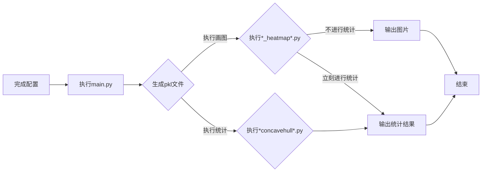

# 动物肝脏病理分析项目代码说明


##  Installation

```pip install -r requirements.txt```

## Configure

```cp sys.ini.example sys.ini```

```gedit sys.ini```  # set the configuration

#### [DEFAULT]

**MASK_RCNN_SEG_MODEL**对应的是Mask RCNN训练的细胞核分割模型文件的存放路径。

**CELL_CLASSIFICATION_MODEL**对应的是细胞核分类模型文件的存放路径。

**INPUT_IMAGE_DIR**对应的是，以主程序main.py调用执行任务时，svs文件的存放路径，只适用于一级目录结构。

**GPU_COUNT**是运行项目代码时需要占用的GPU的数量，一般默认为1。

**GPU_USE**是运行项目代码时，所指定占用的GPU，如指定使用第0张，可以设置为GPU_USE = 0。有关Mask RCNN调用设置的进一步说明，详见https://github.com/matterport/Mask_RCNN/blob/master/mrcnn/config.py


#### [HEATMAP]

**PKL_DIR**是单独执行output_process下的脚本进行后处理时，读取pkl文件的存放路径(pkl文件是对整个svs图像进行细胞核分割之后，所有细胞核的信息，包括横纵坐标轮廓面积和分类概率信息等，由utils/probmat_utils.py生成)，同样只适用于一级目录结构。

**SVS_DIR**对应的是，是单独执行output_process下的脚本调用执行任务时，svs文件的存放路径，同样是只适用于一级目录结构。


## Run

```
python main.py  [--patch_R=] [--patch_C=] [--proba_threshold=] \
 [--pixel_thick=] [--is_drawContours=] [--patch_size=]
```
实际上，上述命令中，`[--patch_R=] [--patch_C=] [--proba_threshold=] [--pixel_thick=] [--is_drawContours=] [--patch_size=]`的参数更多的是直接在main.py函数进行设置，下面给予简单说明：
```python
import tensorflow as tf

from utils.probmat_utils import walk_file
from utils.inference_whole_image import inference_dir

flags = tf.app.flags
FLAGS = flags.FLAGS

flags.DEFINE_integer("patch_R", 512, "patch row")
# 一般要求patch_R是patch_C的整数倍，可以理解为每一次分割区域的高
flags.DEFINE_integer("patch_C", 256, "patch column")
# 可以理解为每一次分割区域的宽
# 如果下面调用的是inference_dir这方法,patch_R和patch_C的参数要根据图片实际的尺寸来设定
# 实际上patch_R/patch_C的数值代表的是每一次输入MaskRCNN进行分割的batch size的上限，以11G显存的GPU为例，一般同一次只够进行500×500大小以下、不超过2张的图片的分割任务。
flags.DEFINE_integer("patch_size", 50, "patch size")
flags.DEFINE_integer("dec_threshold", 165, "detection threshold")
flags.DEFINE_float("cc_prob_threshold", 0.5, "cancer cell probability")
```
只需要将相关参数设置好，直接运行`python main.py`便可以执行主程序。


## 程序架构说明

### 流程说明


### 目录说明

#### 根目录
在根目录下主要就是**sys.ini**配置文件和**main.py**以及**main.sh**。**main.sh**是加载虚拟python环境以及对`python main.py`的bash命令封装，由于本例git仓库不包含python虚拟环境，所以该bash脚本现已不再使用。

#### ./utils/
该目录存放的是项目工程代码中,前期处理有用到的内部功能封装脚本，比如对opencv的封装**opencv_utils.py**、对openslide的封装**openslide_utils.py**、日志记录的封装**log_utils.py**。其中最为重要的脚本，是**probmat_utils.py**,该脚本为main.py所调用，里面负责进行Mask RCNN和各种分类模型的加载，通过内部核心方法实现整个细胞核分割→细胞核分类→细胞核信息汇总→基础二值图生成的功能。该脚本不建议直接单独运行，最好是通过执行主程序main.py调用而启动。

另外，针对单独的已经截取好的1024×1024的svs截图(png格式)，创建了一个专用的脚本来跑细胞核统计信息，此脚本为**inference_whole_image.py**。该脚本同样不建议直接单独运行，最好是通过执行主程序main.py调用而启动。


#### ./cell_classifition/
该目录主要存放进行细胞核分类以及信息汇总的功能，主要供**./utils/probmat_utils.py**或**./utils/inference_whole_image.py**调用。


#### ./Mask_RCNN/
该目录存放的是整个Mask RCNN工程代码，该工程引用自https://github.com/matterport/Mask_RCNN


#### ./output/
该目录是存放的是程序输出的结果文件，包括生成的pkl文件、密度矩阵文件、各种画图的图像文件和统计结果的cvs文本。

#### ./logs/
程序运行日志文件保存的地方